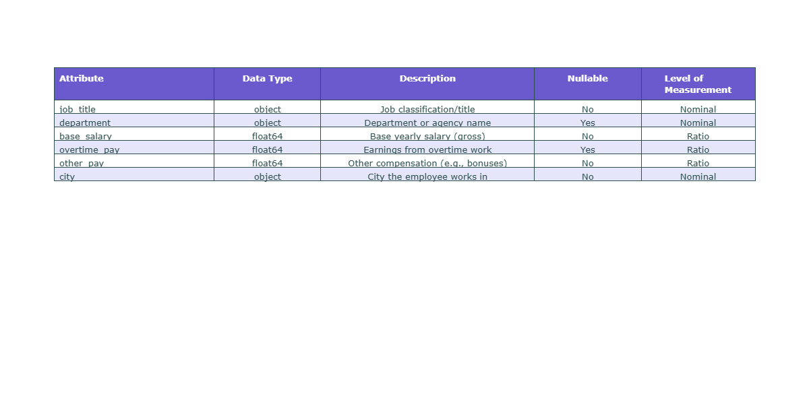

# Employee Compensation Case Study

## By Biose Ugbo, Maurice Otieno, Yoryi Roque, and Wanos Bahiru

---

## Introduction

As college students and aspiring data scientists, we are curious about salary variations across different roles and cities. A key decision young professionals face when starting their careers is choosing where to work. To explore this, we focused on New York City, Philadelphia, and San Francisco, major urban centers with extensive government jobs that offer diverse employment opportunities. These cities are attractive destinations for young professionals and provide a rich dataset of public sector salaries.

Government jobs are typically stable and offer a wide range of positions. Their compensation data is also more transparent and standardized compared to private sector roles, which makes it easier to analyze salary distributions. We collected the data from [San Francisco](https://catalog.data.gov/dataset/employee-compensation), [New York](https://catalog.data.gov/dataset/citywide-payroll-data-fiscal-year), and [Philadelphia](https://catalog.data.gov/dataset/city-employee-earnings), which house publicly available salary information from various government agencies. However, combining data from the three cities posed challenges, as each dataset used different formats and naming conventions. For example, similar jobs in each city were labeled differently, and some cities listed only base salaries, while others included overtime and additional pay.

To address these issues, we standardized job titles by grouping similar roles across cities into clusters and aligned key salary components such as base salary, overtime, and other pay types. After cleaning and transforming the data, we successfully built a unified dataset that allows for meaningful comparisons of salary trends across the three cities. This analysis offers valuable insights into how government compensation varies across regions and provides a clearer picture for those considering public sector careers in New York, Philadelphia, and San Francisco.

Our hypothesis going into this project is that employee compensation depends on city and job title. The following two null hypotheses capture the major research questions we are trying to answer:

- **H₀**: Average salary for all government jobs is equal  
- **H₀**: There is no difference between the average salaries for similar government jobs across these three different cities

## 📊 Data Summary

We used public datasets from:
- [Philadelphia](https://catalog.data.gov/dataset/city-employee-earnings)
- [New York City](https://catalog.data.gov/dataset/citywide-payroll-data-fiscal-year)
- [San Francisco](https://catalog.data.gov/dataset/employee-compensation)

| Column         | Description |
|----------------|-------------|
| `job_title`    | Job classification/title |
| `department`   | Government agency or department |
| `base_salary`  | Base yearly salary (gross) |
| `overtime_pay` | Earnings from overtime work |
| `other_pay`    | Other compensation (e.g., bonuses) |
| `city`         | City the employee works in |

📈 Final dataset size: ~2.7 million records

---

## Data Organization

To prepare our dataset for analysis and modeling, we used government employee compensation data from three U.S. cities: **Philadelphia**, **New York City**, and **San Francisco**. Each city’s dataset had a different structure and naming convention, so we followed a detailed cleaning and standardization process to combine them into a single usable dataset.

We began by uploading the three raw CSV files into our Google Colab environment. These files were titled: `Philadelphia Dataset.csv`, `NEWYORK_Data.csv`, and `SanFrancisco Dataset.csv`. Each file contained information about public sector jobs, including salaries, job titles, and departments. However, the columns were labeled differently across the datasets, so our first task was to extract only the relevant information.

For each dataset, we selected five key columns that were important for our research questions: the employee’s **job title**, the **department** they worked in, their **base salary**, any **overtime pay**, and any **other forms of compensation** such as bonuses. We then standardized the column names to be consistent across all three datasets. For example, even if one city called it "Salaries" and another called it "Base Salary", we renamed them all to `base_salary`. This made the datasets compatible and easy to merge.

Next, we added a new column called `city` to each dataset, indicating which city the data came from. This allowed us to later analyze trends and salary differences across cities. We labeled each row accordingly with "Philadelphia", "New York", or "San Francisco".

After this, we combined the three cleaned datasets into one using a simple `concat` function in pandas. This created a single dataset with over **2.7 million rows**, each representing a unique government employee record from one of the three cities.

Before saving the final version, we did some additional cleaning. We converted all salary-related columns to numeric data types to make sure they could be used in calculations and machine learning models. We also removed any rows where the base salary or job title was missing, since these are essential for our analysis.

Finally, we saved the cleaned and combined dataset as `placeholder.csv`. This file contains six columns: `job_title`, `department`, `base_salary`, `overtime_pay`, `other_pay`, and `city`. It served as the foundation for all of our Exploratory Data Analysis and machine learning tasks.

---

## Data Understanding - Exploratory Data Analysis (EDA)

In this project, we explore a combined dataset of government employee compensation across Philadelphia, New York City, and San Francisco. The unified dataset (placeholder.csv) includes cleaned and standardized columns derived from public payroll data in each city. Understanding the structure of this dataset is essential for conducting meaningful exploratory data analysis (EDA) and building machine learning (ML) models.

The following table provides a detailed data dictionary that outlines each variable, its data type, whether or not it contains missing values, and a clear description of what it represents. This step ensures transparency and improves the reproducibility of our analysis.
Each row represents a public employee. The table below shows the structure:

This table was generated using Plotly, which allows for a clear and aesthetically structured overview of our dataset’s schema.

Nominal: job_title, department, city
Ratio: over_time pay, base_salary, and other_pay

This graph shows which features most influenced base salary predictions in our Random Forest model. `other_pay` came out as the most important, followed by `overtime_pay`. Interestingly, `city_New York` ranked ahead of the other cities, suggesting more variation in pay within that city.

.png)

The bar chart highlights the most lucrative roles based on median base salary across the dataset. The top roles are predominantly in public health and medical services.

.png)

.png)

.png)

The salary distribution in Philadelphia reveals a clear and well-structured compensation pattern. The histogram shows two distinct peaks, indicating a bimodal distribution. The first and slightly lower peak appears around the 60,000–70,000 range, while the second and more prominent peak is situated around 90,000–100,000. This suggests that a large portion of employees fall into two major salary bands, likely corresponding to different job classifications or tiers of government service. These could represent, for instance, unionized administrative positions at the lower mode and professional or supervisory roles at the higher one.

The distribution for New York appears broadly dispersed, with visible clustering around 60,000–100,000, and several smaller peaks across the range. These more meaningful portions of the histogram resemble the structured pay bands seen in other cities like Philadelphia, indicating the presence of formal pay grades. However, their visibility is heavily muted by the distortion caused by the zeros.

The salary distribution in San Francisco is both rich and complex, showing a broad range of earnings that sets it apart from Philadelphia and New York. Unlike the latter two cities, San Francisco displays a right-skewed distribution with a long tail extending beyond 200,000, and in some cases, well past 400,000. This indicates the presence of a significant number of high-income earners, possibly reflecting the city’s concentration of highly compensated public-sector roles such as physicians, police/fire overtime-heavy positions, or senior technical staff. The bulk of salaries appears concentrated in the 60,000 to 120,000 range, with visible clustering around 80,000 to 100,000. This aligns with what we might expect from a structured public payroll system in a high-cost urban area — many roles fall within a middle-to-upper band, likely due to local living costs and union contracts. The relatively large spread in salary values — from just above 20,000 to well beyond 300,000 — suggests a diverse set of roles within the dataset, ranging from entry-level clerical positions to high-level management or specialized staff.

## Smoothed Salary distribution

Philadelphia and New York both exhibit bimodal distributions, suggesting two primary salary bands within those cities, with peaks around 40K–90K. San Francisco displays a broader, unimodal distribution, with a peak around $75K and a long right tail, indicating a wider salary range and more high earners. The density is overall low, reflecting the smoothing and normalization across a large salary range.

## Base Salary Boxplot by City

.png)

We also want to know which cities have higher base salaries than the others.San Francisco is likely to have higher median base salary than both New York and Philadelphia, due to its elevated cost of living and the need to offer competitive compensation to attract and retain skilled public employees, especially in high-demand roles like tech, healthcare, and engineering. We would like to show this by running a box plot.

.png)

The box plot clearly confirms the hypothesis that San Francisco has the highest median base salary among the three cities. Its salary distribution is centered significantly higher than those of New York and Philadelphia, reflecting the city’s elevated cost of living and the need for competitive public sector compensation. While Philadelphia shows the lowest median and a relatively narrow, compressed distribution—indicative of a more standardized pay structure—New York has a broader spread with a median slightly above Philadelphia's but still well below San Francisco’s. Notably, New York's wider range and lower whiskers reflect earlier observations of anomalously low or missing base salary entries, possibly compensated through other pay. San Francisco also displays the largest number of high-end outliers, suggesting the presence of extremely well-compensated roles or data inconsistencies. Overall, the box plot supports the idea that San Francisco leads in base salary, while Philadelphia maintains a rigid pay scale, and New York’s structure is more varied and potentially data-skewed.

Having studied the distribution of base salaries, we turn our attention to total compensation. In analyzing public sector compensation, it's not enough to look at base salary alone. Employees may receive significant earnings from overtime or other pay components. Understanding the proportion of each component in the total compensation provides insight into how cities structure pay, manage staffing, and rely on variable compensation. This breakdown can also uncover departments or job roles where base pay is low, but total earnings are heavily supplemented by other means. We begin by making the assumption that "In most cities, the majority of an employee's total compensation comes from base salary, with overtime and other pay contributing less than 30% combined.

We then tabulate this data to actually show the percentages of the total compesation each compensation type contributes.

.png) 

The bar plot reveals that the Sheriff's Department stands out as the top department in terms of average overtime pay, with values exceeding $32,000 per employee. This is closely followed by the Fire Department and Police, both of which are traditionally known for shift-based, around-the-clock operations that require frequent overtime coverage. These results are consistent with expectations, as public safety departments often depend on overtime to fill coverage gaps, accommodate emergencies, or manage understaffing.

Other departments that appear in the top 10, such as Emergency Management, Emergency Communications, and Sanitation, also reflect roles that support critical infrastructure and may operate outside of regular business hours. These roles often experience spikes in demand (e.g., during storms, emergencies, or service disruptions), further explaining their high average overtime.
Other departments that appear in the top 10, such as Emergency Management, Emergency Communications, and Sanitation, also reflect roles that support critical infrastructure and may operate outside of regular business hours. These roles often experience spikes in demand (e.g., during storms, emergencies, or service disruptions), further explaining their high average overtime.

.png)

The bar chart highlights the most lucrative roles based on median base salary across the dataset. At the top of the list is the Physician Administrator, DPH, with a median base salary approaching $450,000, closely followed by the Assistant Medical Examiner (Hourly) — suggesting that high-paying roles in this dataset are predominantly in public health and medical services.

## Hypothesis Testing

The Kruskal–Wallis test results reveal that both job title and city have a statistically significant impact on total pay. The test comparing total pay across job titles yields a very high H-statistic of 717,512.38 with a p-value of effectively 0, indicating that differences in total compensation between job titles are highly significant and not due to random variation. Similarly, the comparison across cities results in an H-statistic of 58,469.95 with a p-value of 0, confirming that pay varies meaningfully by location as well. While both factors influence total pay, the substantially higher H-value for job title suggests it has a stronger effect than city. These results underscore that an individual’s role and geographic location are key determinants of their overall earnings.

This finding is consistent with our hypothesis stated in our introduction that employee compensation is dependent acorss job titles and cities.

📊 Kruskal-Wallis Test Results
Total Pay vs Job Title: H = 717512.3776, p = 0.0000e+00
Total Pay vs City:      H = 58469.9493, p = 0.0000e+00

---

## Machine Learning Insights

In this code, machine learning is applied to predict employee salaries based on factors such as job title, city, and additional compensation (e.g., overtime and other pay). The process involves preparing the data by cleaning and encoding categorical features using one-hot encoding and standardizing numerical values. A gradient boosting model called LightGBM is then trained on a sample of this processed data to learn patterns and relationships between the input features and the target salary. Once trained, the model can predict salaries for new or unseen employee profiles. By evaluating its performance using metrics like R² we can assess how accurately the model explains variations in salary. This approach can help uncover insights about salary trends across different cities and roles and support data-driven compensation decisions.

Based on the model’s results, which achieved an R² of approximately 72%, we can draw several valuable insights. The model indicates that job title, city, and additional compensation (overtime and other pay) are meaningful predictors of base salary, but they do not capture the full picture—suggesting that other factors like experience, education, or department may play a significant role. The moderate predictive power shows that while these features help explain salary differences, there's room for improvement through enhanced data. Still, the model reveals that certain cities and job roles are consistently associated with higher or lower salaries, and that non-base compensation contributes significantly to overall pay. This type of model could be used for identifying regional pay disparities, supporting compensation planning, and flagging underpaid roles—especially when further refined with more complete data.

Other Pay refers to any extra compensation a public employee receives that is not part of their base salary or overtime pay.

It usually includes things like:

Bonuses
Retroactive pay adjustments
Incentives
Hazard pay
Severance or payout upon retirement
Stipends or allowances (e.g., for housing, uniforms, or transportation)
Why Did It Show Up as the #1 Predictor in the ML Model?

It actually makes a lot of sense:

Even though you're trying to predict base salary, the other_pay column strongly correlates with high-paying roles and seniority.
In many cases, only senior-level or specialty jobs receive large "other pay" packages.
For example: A fire chief or medical examiner might get a large bonus or reimbursement on top of their base pay.
So while other_pay doesn’t cause a higher base salary, it often appears with jobs that already pay well, which is why the model sees it as important.

The machine learning model identified other_pay as the strongest predictor of base salary. This makes intuitive sense — employees in high-ranking or specialized roles often receive additional forms of compensation such as bonuses, stipends, or one-time payouts. These forms of ‘other pay’ are strongly associated with seniority, job title, and overall earnings power.”

## ML Part 1
This block of code builds a machine learning model to analyze how different cities and numeric compensation components (overtime and other pay) influence base salary. The dataset is cleaned by dropping rows with missing salary values. A random sample of 5,000 records is used to reduce memory load. The features (city, overtime pay, and other pay) are preprocessed using a column transformer that one-hot encodes the categorical city variable and scales the numeric features. A Random Forest Regressor is then trained on the data to predict base salary. After training, the model’s feature importances are extracted to determine which variables most influence salary predictions. These importances are visualized in a bar plot, helping to identify which cities or numeric variables (like overtime pay) have the greatest impact on salary outcomes. This analysis is especially useful for understanding geographic and compensation structure effects on pay.

.png)

## ML Part 2
We wrote code to build a LightGBM regression model to predict log-transformed base salaries based on features like city, job title, overtime pay, and other pay. It first cleans and preprocesses the data by handling missing values and filtering out extreme values. The dataset is sampled to 5000 rows for efficiency, and categorical features are one-hot encoded while numerical features are standardized. The model is trained and evaluated using R² and MAE, resulting in an R² of 0.7163, indicating that the model explains 71.63% of the variance in salaries, and a MAE of 0.80, meaning the average prediction error is around 80% of the transformed salary value. This shows decent predictive power for salary using `job_title`, `city`, `overtime_pay`, and `other_pay`.

---

## Project Resources

📁 **Data Repository (Google Drive)** : [Access the full dataset](https://drive.google.com/drive/folders/1HWVh9lLD9AbmIfwc7M2vn55fbR9ZKStM?usp=drive_link)  
📹 **5-Minute Video Presentation**: [Watch here](https://youtu.be/95L-Ps0Roj4)
📹 **Google Colab Tutorial Walkthrough**: [Watch walkthrough](https://youtu.be/mPa75j7P100)  
📊 **Project Slides**: [Google Slides](https://docs.google.com/presentation/d/1hezgQOHoLfX9G5gEsrmQ3CcrQoJRH5h65-TzNkej9No/edit?usp=sharing)
📓 **Colab Notebook**: [Open Colab Notebook](https://colab.research.google.com/drive/159OHt7bwRdVXZFmCjwO2d_RVej248dP9)
**.io**: [Acess Live Site] (https://otienomaurice1.github.io/city_salary_capstone/)

## Acknowledgements

Thanks to:

- **Professor Lopez**, The greatest professor at Lafayette college, for instructing us through DS-201,
- Open-source libraries: pandas, seaborn, scikit-learn, LightGBM
- City of Philadelphia, New York, and San Francisco for transparency and the data.
