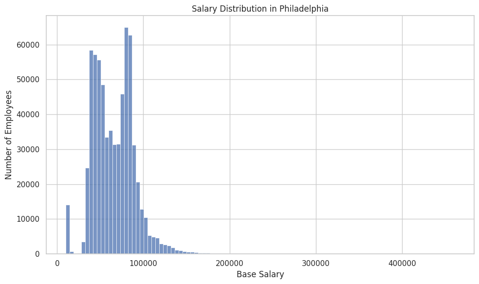
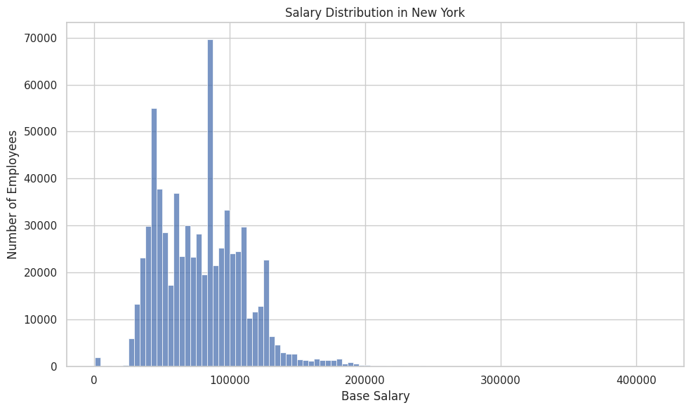
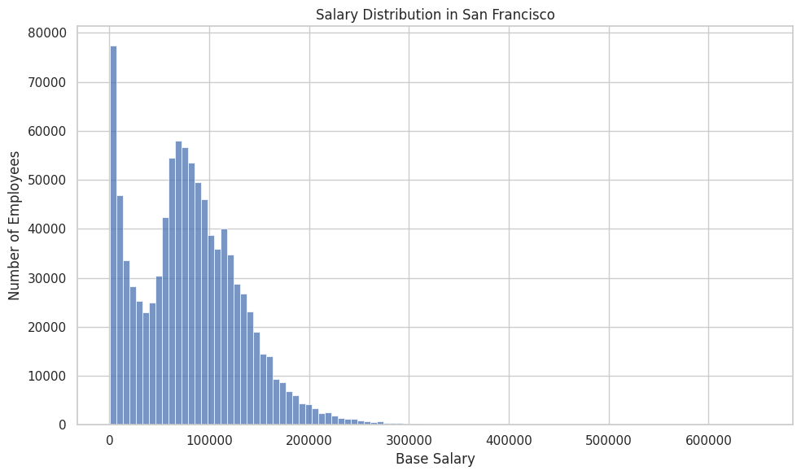
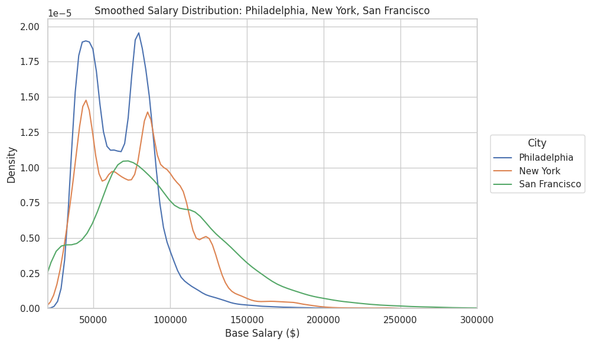
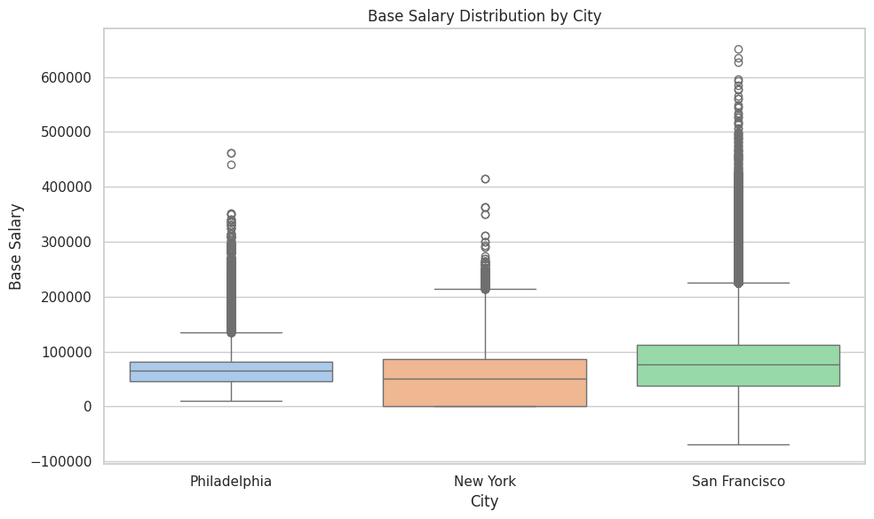
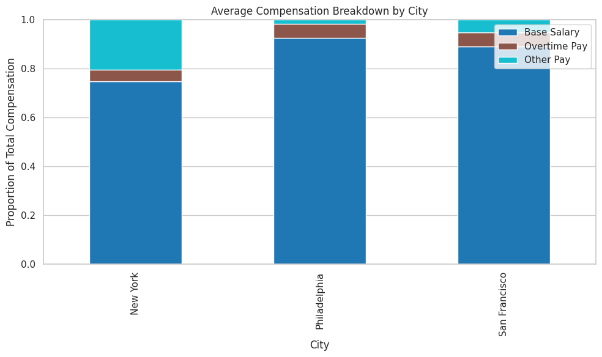
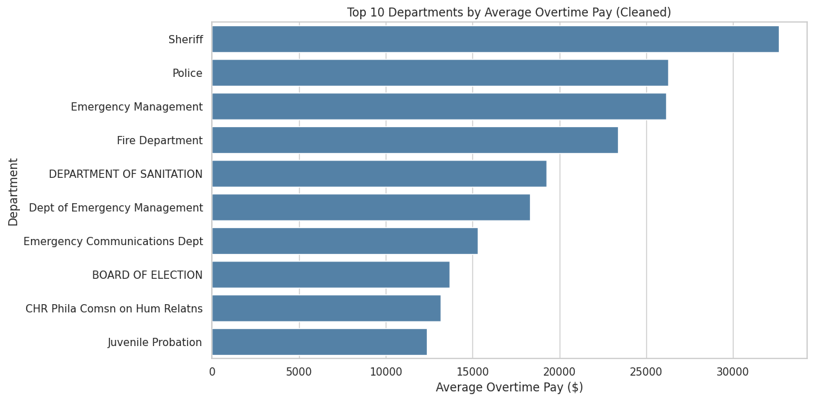
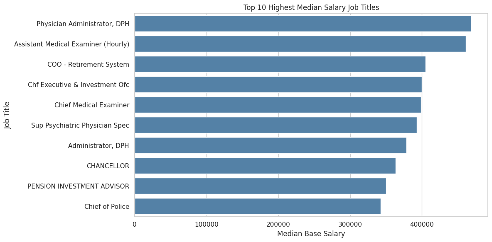
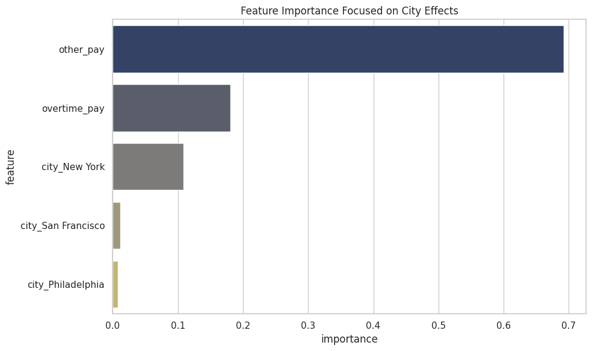

# Employee Compensation Case Study

## By Biose Ugbo, Mauirce Otieno, Yoryi Roque, and Wanos Bahiru

### Introduction

As college students and aspiring data scientists, we are curious about salary variations across different roles and cities. A key decision young professionals face when starting their careers is choosing where to work. To explore this, we focused on New York City, Philadelphia, and San Francisco, major urban centers with extensive government jobs that offer diverse employment opportunities. These cities are attractive destinations for young professionals and provide a rich dataset of public sector salaries.

Government jobs are typically stable and offer a wide range of positions. Their compensation data is also more transparent and standardized compared to private sector roles, which makes it easier to analyze salary distributions. We collected the data from  [SanFrancisco ](https://catalog.data.gov/dataset/employee-compensation), [New York](https://catalog.data.gov/dataset/citywide-payroll-data-fiscal-year), and [Philadelphia](
https://catalog.data.gov/dataset/city-employee-earnings) which houses publicly available salary information from various government agencies. However, combining data from the three cities posed challenges, as each dataset used different formats and naming conventions. For example, similar jobs in each city were labeled differently, and some cities listed only base salaries, while others included overtime and additional pay.

To address these issues, we standardized job titles by grouping similar roles across cities into clusters and aligned key salary components such as base salary, overtime, and other pay types. After cleaning and transforming the data, we successfully built a unified dataset that allows for meaningful comparisons of salary trends across the three cities. This analysis offers valuable insights into how government compensation varies across regions and provides a clearer picture for those considering public sector careers in New York, Philadelphia, and San Francisco.

Our hypothesis going into this project is that employee compnesation depends on city and job title. The following two null hypothesis capture the major research question we are trying to answer.

Ho: Average salary for all government jobs is equal  
Ho: There is no differnce between the average salaries for similar government jobs across these three different cities


```
# This is formatted as code
```


# Data Organization

To prepare our dataset for analysis and modeling, we used government employee compensation data from three U.S. cities: **Philadelphia**, **New York City**, and **San Francisco**. Each city’s dataset had a different structure and naming convention, so we followed a detailed cleaning and standardization process to combine them into a single usable dataset.

We began by uploading the three raw CSV files into our Google Colab environment. These files were titled: `Philadelphia Dataset.csv`, `NEWYORK_Data.csv`, and `SanFrancisco Dataset.csv`. Each file contained information about public sector jobs, including salaries, job titles, and departments. However, the columns were labeled differently across the datasets, so our first task was to extract only the relevant information.

For each dataset, we selected five key columns that were important for our research questions: the employee’s **job title**, the **department** they worked in, their **base salary**, any **overtime pay**, and any **other forms of compensation** such as bonuses. We then standardized the column names to be consistent across all three datasets. For example, even if one city called it "Salaries" and another called it "Base Salary", we renamed them all to `base_salary`. This made the datasets compatible and easy to merge.

Next, we added a new column called `city` to each dataset, indicating which city the data came from. This allowed us to later analyze trends and salary differences across cities. We labeled each row accordingly with "Philadelphia", "New York", or "San Francisco".

After this, we combined the three cleaned datasets into one using a simple `concat` function in pandas. This created a single dataset with over **2.7 million rows**, each representing a unique government employee record from one of the three cities.

Before saving the final version, we did some additional cleaning. We converted all salary-related columns to numeric data types to make sure they could be used in calculations and machine learning models. We also removed any rows where the base salary or job title was missing, since these are essential for our analysis.

Finally, we saved the cleaned and combined dataset as `placeholder.csv`. This file contains six columns: `job_title`, `department`, `base_salary`, `overtime_pay`, `other_pay`, and `city`. It served as the foundation for all of our Exploratory Data Analysis and machine learning tasks.

This cleaning process was essential to ensure consistency, accuracy, and usability across all parts of our project.

    Downloading...
    From (original): https://drive.google.com/uc?id=1_qpjeiKqN3txQH7B-r2RhS21ccEcVB0f
    From (redirected): https://drive.google.com/uc?id=1_qpjeiKqN3txQH7B-r2RhS21ccEcVB0f&confirm=t&uuid=0b3fa150-986d-4fd5-9aee-733e3760d58a
    To: /content/combined_city_salaries.csv
    100%|██████████| 200M/200M [00:01<00:00, 131MB/s]
    


    <IPython.core.display.Javascript object>


    <IPython.core.display.Javascript object>


Here's a peak into the first few entries of our data set.


  <div id="df-10340832-0854-4724-99b1-b5b44f4082c6" class="colab-df-container">
    <div>
<style scoped>
    .dataframe tbody tr th:only-of-type {
        vertical-align: middle;
    }

    .dataframe tbody tr th {
        vertical-align: top;
    }

    .dataframe thead th {
        text-align: right;
    }
</style>
<table border="1" class="dataframe">
  <thead>
    <tr style="text-align: right;">
      <th></th>
      <th>job_title</th>
      <th>department</th>
      <th>base_salary</th>
      <th>overtime_pay</th>
      <th>other_pay</th>
      <th>city</th>
    </tr>
  </thead>
  <tbody>
    <tr>
      <th>0</th>
      <td>Deputy Sheriff Captain</td>
      <td>SHF Sheriff</td>
      <td>95557.0</td>
      <td>NaN</td>
      <td>1400.00</td>
      <td>Philadelphia</td>
    </tr>
    <tr>
      <th>1</th>
      <td>Police Sergeant</td>
      <td>PPD Police</td>
      <td>94674.0</td>
      <td>NaN</td>
      <td>-4036.47</td>
      <td>Philadelphia</td>
    </tr>
    <tr>
      <th>2</th>
      <td>Deputy Sheriff Captain</td>
      <td>SHF Sheriff</td>
      <td>92550.0</td>
      <td>NaN</td>
      <td>0.00</td>
      <td>Philadelphia</td>
    </tr>
    <tr>
      <th>3</th>
      <td>Police Officer 1</td>
      <td>PPD Police</td>
      <td>73433.0</td>
      <td>NaN</td>
      <td>-1716.09</td>
      <td>Philadelphia</td>
    </tr>
    <tr>
      <th>4</th>
      <td>Firefighter</td>
      <td>PFD Fire</td>
      <td>83048.0</td>
      <td>10636.58</td>
      <td>43048.77</td>
      <td>Philadelphia</td>
    </tr>
  </tbody>
</table>
</div>
    <div class="colab-df-buttons">

  <div class="colab-df-container">
    <button class="colab-df-convert" onclick="convertToInteractive('df-10340832-0854-4724-99b1-b5b44f4082c6')"
            title="Convert this dataframe to an interactive table."
            style="display:none;">

  <svg xmlns="http://www.w3.org/2000/svg" height="24px" viewBox="0 -960 960 960">
    <path d="M120-120v-720h720v720H120Zm60-500h600v-160H180v160Zm220 220h160v-160H400v160Zm0 220h160v-160H400v160ZM180-400h160v-160H180v160Zm440 0h160v-160H620v160ZM180-180h160v-160H180v160Zm440 0h160v-160H620v160Z"/>
  </svg>
    </button>

  <style>
    .colab-df-container {
      display:flex;
      gap: 12px;
    }

    .colab-df-convert {
      background-color: #E8F0FE;
      border: none;
      border-radius: 50%;
      cursor: pointer;
      display: none;
      fill: #1967D2;
      height: 32px;
      padding: 0 0 0 0;
      width: 32px;
    }

    .colab-df-convert:hover {
      background-color: #E2EBFA;
      box-shadow: 0px 1px 2px rgba(60, 64, 67, 0.3), 0px 1px 3px 1px rgba(60, 64, 67, 0.15);
      fill: #174EA6;
    }

    .colab-df-buttons div {
      margin-bottom: 4px;
    }

    [theme=dark] .colab-df-convert {
      background-color: #3B4455;
      fill: #D2E3FC;
    }

    [theme=dark] .colab-df-convert:hover {
      background-color: #434B5C;
      box-shadow: 0px 1px 3px 1px rgba(0, 0, 0, 0.15);
      filter: drop-shadow(0px 1px 2px rgba(0, 0, 0, 0.3));
      fill: #FFFFFF;
    }
  </style>

    <script>
      const buttonEl =
        document.querySelector('#df-10340832-0854-4724-99b1-b5b44f4082c6 button.colab-df-convert');
      buttonEl.style.display =
        google.colab.kernel.accessAllowed ? 'block' : 'none';

      async function convertToInteractive(key) {
        const element = document.querySelector('#df-10340832-0854-4724-99b1-b5b44f4082c6');
        const dataTable =
          await google.colab.kernel.invokeFunction('convertToInteractive',
                                                    [key], {});
        if (!dataTable) return;

        const docLinkHtml = 'Like what you see? Visit the ' +
          '<a target="_blank" href=https://colab.research.google.com/notebooks/data_table.ipynb>data table notebook</a>'
          + ' to learn more about interactive tables.';
        element.innerHTML = '';
        dataTable['output_type'] = 'display_data';
        await google.colab.output.renderOutput(dataTable, element);
        const docLink = document.createElement('div');
        docLink.innerHTML = docLinkHtml;
        element.appendChild(docLink);
      }
    </script>
  </div>


    <div id="df-05f6ca11-256e-49d9-b97a-b3b6ea5e3dee">
      <button class="colab-df-quickchart" onclick="quickchart('df-05f6ca11-256e-49d9-b97a-b3b6ea5e3dee')"
                title="Suggest charts"
                style="display:none;">

<svg xmlns="http://www.w3.org/2000/svg" height="24px"viewBox="0 0 24 24"
     width="24px">
    <g>
        <path d="M19 3H5c-1.1 0-2 .9-2 2v14c0 1.1.9 2 2 2h14c1.1 0 2-.9 2-2V5c0-1.1-.9-2-2-2zM9 17H7v-7h2v7zm4 0h-2V7h2v10zm4 0h-2v-4h2v4z"/>
    </g>
</svg>
      </button>

<style>
  .colab-df-quickchart {
      --bg-color: #E8F0FE;
      --fill-color: #1967D2;
      --hover-bg-color: #E2EBFA;
      --hover-fill-color: #174EA6;
      --disabled-fill-color: #AAA;
      --disabled-bg-color: #DDD;
  }

  [theme=dark] .colab-df-quickchart {
      --bg-color: #3B4455;
      --fill-color: #D2E3FC;
      --hover-bg-color: #434B5C;
      --hover-fill-color: #FFFFFF;
      --disabled-bg-color: #3B4455;
      --disabled-fill-color: #666;
  }

  .colab-df-quickchart {
    background-color: var(--bg-color);
    border: none;
    border-radius: 50%;
    cursor: pointer;
    display: none;
    fill: var(--fill-color);
    height: 32px;
    padding: 0;
    width: 32px;
  }

  .colab-df-quickchart:hover {
    background-color: var(--hover-bg-color);
    box-shadow: 0 1px 2px rgba(60, 64, 67, 0.3), 0 1px 3px 1px rgba(60, 64, 67, 0.15);
    fill: var(--button-hover-fill-color);
  }

  .colab-df-quickchart-complete:disabled,
  .colab-df-quickchart-complete:disabled:hover {
    background-color: var(--disabled-bg-color);
    fill: var(--disabled-fill-color);
    box-shadow: none;
  }

  .colab-df-spinner {
    border: 2px solid var(--fill-color);
    border-color: transparent;
    border-bottom-color: var(--fill-color);
    animation:
      spin 1s steps(1) infinite;
  }

  @keyframes spin {
    0% {
      border-color: transparent;
      border-bottom-color: var(--fill-color);
      border-left-color: var(--fill-color);
    }
    20% {
      border-color: transparent;
      border-left-color: var(--fill-color);
      border-top-color: var(--fill-color);
    }
    30% {
      border-color: transparent;
      border-left-color: var(--fill-color);
      border-top-color: var(--fill-color);
      border-right-color: var(--fill-color);
    }
    40% {
      border-color: transparent;
      border-right-color: var(--fill-color);
      border-top-color: var(--fill-color);
    }
    60% {
      border-color: transparent;
      border-right-color: var(--fill-color);
    }
    80% {
      border-color: transparent;
      border-right-color: var(--fill-color);
      border-bottom-color: var(--fill-color);
    }
    90% {
      border-color: transparent;
      border-bottom-color: var(--fill-color);
    }
  }
</style>

      <script>
        async function quickchart(key) {
          const quickchartButtonEl =
            document.querySelector('#' + key + ' button');
          quickchartButtonEl.disabled = true;  // To prevent multiple clicks.
          quickchartButtonEl.classList.add('colab-df-spinner');
          try {
            const charts = await google.colab.kernel.invokeFunction(
                'suggestCharts', [key], {});
          } catch (error) {
            console.error('Error during call to suggestCharts:', error);
          }
          quickchartButtonEl.classList.remove('colab-df-spinner');
          quickchartButtonEl.classList.add('colab-df-quickchart-complete');
        }
        (() => {
          let quickchartButtonEl =
            document.querySelector('#df-05f6ca11-256e-49d9-b97a-b3b6ea5e3dee button');
          quickchartButtonEl.style.display =
            google.colab.kernel.accessAllowed ? 'block' : 'none';
        })();
      </script>
    </div>

    </div>
  </div>


# Data Understanding


In this project, we explore a combined dataset of government employee compensation across Philadelphia, New York City, and San Francisco. The unified dataset (placeholder.csv) includes cleaned and standardized columns derived from public payroll data in each city. Understanding the structure of this dataset is essential for conducting meaningful exploratory data analysis (EDA) and building machine learning (ML) models.

The following table provides a detailed data dictionary that outlines each variable, its data type, whether or not it contains missing values, and a clear description of what it represents. This step ensures transparency and improves the reproducibility of our analysis.

This table was generated using Plotly, which allows for a clear and aesthetically structured overview of our dataset’s schema.

Ordinal: job_title, department, city    
Cardinal: over_time pay, base_salry, and other_pay    
Interval:     
Ratio:   


<html>
<head><meta charset="utf-8" /></head>
<body>
    <div>            <script src="https://cdnjs.cloudflare.com/ajax/libs/mathjax/2.7.5/MathJax.js?config=TeX-AMS-MML_SVG"></script><script type="text/javascript">if (window.MathJax && window.MathJax.Hub && window.MathJax.Hub.Config) {window.MathJax.Hub.Config({SVG: {font: "STIX-Web"}});}</script>                <script type="text/javascript">window.PlotlyConfig = {MathJaxConfig: 'local'};</script>
        <script charset="utf-8" src="https://cdn.plot.ly/plotly-2.35.2.min.js"></script>                <div id="77ee4730-1f92-4030-b8f9-a4a0b3b00c3f" class="plotly-graph-div" style="height:600px; width:1200px;"></div>            <script type="text/javascript">                                    window.PLOTLYENV=window.PLOTLYENV || {};                                    if (document.getElementById("77ee4730-1f92-4030-b8f9-a4a0b3b00c3f")) {                    Plotly.newPlot(                        "77ee4730-1f92-4030-b8f9-a4a0b3b00c3f",                        [{"cells":{"align":["left","center"],"fill":{"color":[["white","lavender","white","lavender","white","lavender"]]},"font":{"color":"darkslategray","size":13},"line":{"color":"darkslategray"},"values":[["job_title","department","base_salary","overtime_pay","other_pay","city"],["object","object","float64","float64","float64","object"],["Job classification\u002ftitle","Department or agency name","Base yearly salary (gross)","Earnings from overtime work","Other compensation (e.g., bonuses)","City the employee works in"],["No","Yes","No","Yes","No","No"],["Ordinal","Ordinal","Ratio","Ratio","Ratio","Ordinal"]]},"columnorder":[1,2,3,4,5],"columnwidth":[450,300,600,300,320],"header":{"align":["left","center"],"fill":{"color":"slateblue"},"font":{"color":"white","size":13},"line":{"color":"darkslategray"},"values":["\u003cb\u003eAttribute\u003c\u002fb\u003e","\u003cb\u003eData Type\u003c\u002fb\u003e","\u003cb\u003eDescription\u003c\u002fb\u003e","\u003cb\u003eNullable\u003c\u002fb\u003e","\u003cb\u003eLevel of Measurement\u003c\u002fb\u003e"]},"type":"table"}],                        {"template":{"data":{"histogram2dcontour":[{"type":"histogram2dcontour","colorbar":{"outlinewidth":0,"ticks":""},"colorscale":[[0.0,"#0d0887"],[0.1111111111111111,"#46039f"],[0.2222222222222222,"#7201a8"],[0.3333333333333333,"#9c179e"],[0.4444444444444444,"#bd3786"],[0.5555555555555556,"#d8576b"],[0.6666666666666666,"#ed7953"],[0.7777777777777778,"#fb9f3a"],[0.8888888888888888,"#fdca26"],[1.0,"#f0f921"]]}],"choropleth":[{"type":"choropleth","colorbar":{"outlinewidth":0,"ticks":""}}],"histogram2d":[{"type":"histogram2d","colorbar":{"outlinewidth":0,"ticks":""},"colorscale":[[0.0,"#0d0887"],[0.1111111111111111,"#46039f"],[0.2222222222222222,"#7201a8"],[0.3333333333333333,"#9c179e"],[0.4444444444444444,"#bd3786"],[0.5555555555555556,"#d8576b"],[0.6666666666666666,"#ed7953"],[0.7777777777777778,"#fb9f3a"],[0.8888888888888888,"#fdca26"],[1.0,"#f0f921"]]}],"heatmap":[{"type":"heatmap","colorbar":{"outlinewidth":0,"ticks":""},"colorscale":[[0.0,"#0d0887"],[0.1111111111111111,"#46039f"],[0.2222222222222222,"#7201a8"],[0.3333333333333333,"#9c179e"],[0.4444444444444444,"#bd3786"],[0.5555555555555556,"#d8576b"],[0.6666666666666666,"#ed7953"],[0.7777777777777778,"#fb9f3a"],[0.8888888888888888,"#fdca26"],[1.0,"#f0f921"]]}],"heatmapgl":[{"type":"heatmapgl","colorbar":{"outlinewidth":0,"ticks":""},"colorscale":[[0.0,"#0d0887"],[0.1111111111111111,"#46039f"],[0.2222222222222222,"#7201a8"],[0.3333333333333333,"#9c179e"],[0.4444444444444444,"#bd3786"],[0.5555555555555556,"#d8576b"],[0.6666666666666666,"#ed7953"],[0.7777777777777778,"#fb9f3a"],[0.8888888888888888,"#fdca26"],[1.0,"#f0f921"]]}],"contourcarpet":[{"type":"contourcarpet","colorbar":{"outlinewidth":0,"ticks":""}}],"contour":[{"type":"contour","colorbar":{"outlinewidth":0,"ticks":""},"colorscale":[[0.0,"#0d0887"],[0.1111111111111111,"#46039f"],[0.2222222222222222,"#7201a8"],[0.3333333333333333,"#9c179e"],[0.4444444444444444,"#bd3786"],[0.5555555555555556,"#d8576b"],[0.6666666666666666,"#ed7953"],[0.7777777777777778,"#fb9f3a"],[0.8888888888888888,"#fdca26"],[1.0,"#f0f921"]]}],"surface":[{"type":"surface","colorbar":{"outlinewidth":0,"ticks":""},"colorscale":[[0.0,"#0d0887"],[0.1111111111111111,"#46039f"],[0.2222222222222222,"#7201a8"],[0.3333333333333333,"#9c179e"],[0.4444444444444444,"#bd3786"],[0.5555555555555556,"#d8576b"],[0.6666666666666666,"#ed7953"],[0.7777777777777778,"#fb9f3a"],[0.8888888888888888,"#fdca26"],[1.0,"#f0f921"]]}],"mesh3d":[{"type":"mesh3d","colorbar":{"outlinewidth":0,"ticks":""}}],"scatter":[{"fillpattern":{"fillmode":"overlay","size":10,"solidity":0.2},"type":"scatter"}],"parcoords":[{"type":"parcoords","line":{"colorbar":{"outlinewidth":0,"ticks":""}}}],"scatterpolargl":[{"type":"scatterpolargl","marker":{"colorbar":{"outlinewidth":0,"ticks":""}}}],"bar":[{"error_x":{"color":"#2a3f5f"},"error_y":{"color":"#2a3f5f"},"marker":{"line":{"color":"#E5ECF6","width":0.5},"pattern":{"fillmode":"overlay","size":10,"solidity":0.2}},"type":"bar"}],"scattergeo":[{"type":"scattergeo","marker":{"colorbar":{"outlinewidth":0,"ticks":""}}}],"scatterpolar":[{"type":"scatterpolar","marker":{"colorbar":{"outlinewidth":0,"ticks":""}}}],"histogram":[{"marker":{"pattern":{"fillmode":"overlay","size":10,"solidity":0.2}},"type":"histogram"}],"scattergl":[{"type":"scattergl","marker":{"colorbar":{"outlinewidth":0,"ticks":""}}}],"scatter3d":[{"type":"scatter3d","line":{"colorbar":{"outlinewidth":0,"ticks":""}},"marker":{"colorbar":{"outlinewidth":0,"ticks":""}}}],"scattermapbox":[{"type":"scattermapbox","marker":{"colorbar":{"outlinewidth":0,"ticks":""}}}],"scatterternary":[{"type":"scatterternary","marker":{"colorbar":{"outlinewidth":0,"ticks":""}}}],"scattercarpet":[{"type":"scattercarpet","marker":{"colorbar":{"outlinewidth":0,"ticks":""}}}],"carpet":[{"aaxis":{"endlinecolor":"#2a3f5f","gridcolor":"white","linecolor":"white","minorgridcolor":"white","startlinecolor":"#2a3f5f"},"baxis":{"endlinecolor":"#2a3f5f","gridcolor":"white","linecolor":"white","minorgridcolor":"white","startlinecolor":"#2a3f5f"},"type":"carpet"}],"table":[{"cells":{"fill":{"color":"#EBF0F8"},"line":{"color":"white"}},"header":{"fill":{"color":"#C8D4E3"},"line":{"color":"white"}},"type":"table"}],"barpolar":[{"marker":{"line":{"color":"#E5ECF6","width":0.5},"pattern":{"fillmode":"overlay","size":10,"solidity":0.2}},"type":"barpolar"}],"pie":[{"automargin":true,"type":"pie"}]},"layout":{"autotypenumbers":"strict","colorway":["#636efa","#EF553B","#00cc96","#ab63fa","#FFA15A","#19d3f3","#FF6692","#B6E880","#FF97FF","#FECB52"],"font":{"color":"#2a3f5f"},"hovermode":"closest","hoverlabel":{"align":"left"},"paper_bgcolor":"white","plot_bgcolor":"#E5ECF6","polar":{"bgcolor":"#E5ECF6","angularaxis":{"gridcolor":"white","linecolor":"white","ticks":""},"radialaxis":{"gridcolor":"white","linecolor":"white","ticks":""}},"ternary":{"bgcolor":"#E5ECF6","aaxis":{"gridcolor":"white","linecolor":"white","ticks":""},"baxis":{"gridcolor":"white","linecolor":"white","ticks":""},"caxis":{"gridcolor":"white","linecolor":"white","ticks":""}},"coloraxis":{"colorbar":{"outlinewidth":0,"ticks":""}},"colorscale":{"sequential":[[0.0,"#0d0887"],[0.1111111111111111,"#46039f"],[0.2222222222222222,"#7201a8"],[0.3333333333333333,"#9c179e"],[0.4444444444444444,"#bd3786"],[0.5555555555555556,"#d8576b"],[0.6666666666666666,"#ed7953"],[0.7777777777777778,"#fb9f3a"],[0.8888888888888888,"#fdca26"],[1.0,"#f0f921"]],"sequentialminus":[[0.0,"#0d0887"],[0.1111111111111111,"#46039f"],[0.2222222222222222,"#7201a8"],[0.3333333333333333,"#9c179e"],[0.4444444444444444,"#bd3786"],[0.5555555555555556,"#d8576b"],[0.6666666666666666,"#ed7953"],[0.7777777777777778,"#fb9f3a"],[0.8888888888888888,"#fdca26"],[1.0,"#f0f921"]],"diverging":[[0,"#8e0152"],[0.1,"#c51b7d"],[0.2,"#de77ae"],[0.3,"#f1b6da"],[0.4,"#fde0ef"],[0.5,"#f7f7f7"],[0.6,"#e6f5d0"],[0.7,"#b8e186"],[0.8,"#7fbc41"],[0.9,"#4d9221"],[1,"#276419"]]},"xaxis":{"gridcolor":"white","linecolor":"white","ticks":"","title":{"standoff":15},"zerolinecolor":"white","automargin":true,"zerolinewidth":2},"yaxis":{"gridcolor":"white","linecolor":"white","ticks":"","title":{"standoff":15},"zerolinecolor":"white","automargin":true,"zerolinewidth":2},"scene":{"xaxis":{"backgroundcolor":"#E5ECF6","gridcolor":"white","linecolor":"white","showbackground":true,"ticks":"","zerolinecolor":"white","gridwidth":2},"yaxis":{"backgroundcolor":"#E5ECF6","gridcolor":"white","linecolor":"white","showbackground":true,"ticks":"","zerolinecolor":"white","gridwidth":2},"zaxis":{"backgroundcolor":"#E5ECF6","gridcolor":"white","linecolor":"white","showbackground":true,"ticks":"","zerolinecolor":"white","gridwidth":2}},"shapedefaults":{"line":{"color":"#2a3f5f"}},"annotationdefaults":{"arrowcolor":"#2a3f5f","arrowhead":0,"arrowwidth":1},"geo":{"bgcolor":"white","landcolor":"#E5ECF6","subunitcolor":"white","showland":true,"showlakes":true,"lakecolor":"white"},"title":{"x":0.05},"mapbox":{"style":"light"}}},"width":1200,"height":600},                        {"responsive": true}                    ).then(function(){

var gd = document.getElementById('77ee4730-1f92-4030-b8f9-a4a0b3b00c3f');
var x = new MutationObserver(function (mutations, observer) {{
        var display = window.getComputedStyle(gd).display;
        if (!display || display === 'none') {{
            console.log([gd, 'removed!']);
            Plotly.purge(gd);
            observer.disconnect();
        }}
}});

// Listen for the removal of the full notebook cells
var notebookContainer = gd.closest('#notebook-container');
if (notebookContainer) {{
    x.observe(notebookContainer, {childList: true});
}}

// Listen for the clearing of the current output cell
var outputEl = gd.closest('.output');
if (outputEl) {{
    x.observe(outputEl, {childList: true});
}}

                        })                };                            </script>        </div>
</body>
</html>


#Exploratory Data Analysis

In this section we would like to understand certain aspects of our data. We begin by looking at the distribution of salaries for all the cities. However all 3 of the datasets contain values at or around 0 dollars. What this causes is a huge amount of data points stored at or around the zero value, which affects potential analysis of the data to skew in favor of the very small values. Since our focus is not on these values, and we wish to have them not affect the EDA, the best option is to first check how many values are located in between and then eliminate a small range of the values. In this case, all workers earning less than $500 will be removed from the data set for cleaning.

We begin our analysis of the distribution of the data by plotting histograms for each city in the dataset for salaries. For each unique city, it creates a histogram with using Seaborn, where the X-axis represents base salary ranges and the Y-axis shows the number of employees in each range. Each city’s histogram is plotted in its own figure, allowing for an individual view of how salaries are distributed across employees within that city. The result helps identify patterns such as concentration of pay ranges, presence of outliers, or salary skewness specific to each city.


    

    


    

    


    

    


The salary distribution in Philadelphia reveals a clear and well-structured compensation pattern. The histogram shows two distinct peaks, indicating a bimodal distribution. The first and slightly lower peak appears around the 60,000–70,000 range, while the second and more prominent peak is situated around 90,000–100,000. This suggests that a large portion of employees fall into two major salary bands, likely corresponding to different job classifications or tiers of government service. These could represent, for instance, unionized administrative positions at the lower mode and professional or supervisory roles at the higher one.

The distribution for New York appears broadly dispersed, with visible clustering around 60,000–100,000, and several smaller peaks across the range. These more meaningful portions of the histogram resemble the structured pay bands seen in other cities like Philadelphia, indicating the presence of formal pay grades. However, their visibility is heavily muted by the distortion caused by the zeros.

The salary distribution in San Francisco is both rich and complex, showing a broad range of earnings that sets it apart from Philadelphia and New York. Unlike the latter two cities, San Francisco displays a right-skewed distribution with a long tail extending beyond 200,000, and in some cases, well past 400,000. This indicates the presence of a significant number of high-income earners, possibly reflecting the city’s concentration of highly compensated public-sector roles such as physicians, police/fire overtime-heavy positions, or senior technical staff. The bulk of salaries appears concentrated in the 60,000 to 120,000 range, with visible clustering around 80,000 to 100,000. This aligns with what we might expect from a structured public payroll system in a high-cost urban area — many roles fall within a middle-to-upper band, likely due to local living costs and union contracts. The relatively large spread in salary values — from just above 20,000 to well beyond 300,000 — suggests a diverse set of roles within the dataset, ranging from entry-level clerical positions to high-level management or specialized staff.

## Smoothed Salary distribution

Philadelphia and New York both exhibit bimodal distributions, suggesting two primary salary bands within those cities, with peaks around 40K–90K. San Francisco displays a broader, unimodal distribution, with a peak around $75K and a long right tail, indicating a wider salary range and more high earners. The density is overall low, reflecting the smoothing and normalization across a large salary range.


    

    


We also want to know which cities have higher base salaries than the others.San Francisco is likely to have higher median base salary than both New York and Philadelphia, due to its elevated cost of living and the need to offer competitive compensation to attract and retain skilled public employees, especially in high-demand roles like tech, healthcare, and engineering. We would like to show this by running a box plot.

    <ipython-input-36-9a61b56f193a>:14: FutureWarning:
    
    
    
    Passing `palette` without assigning `hue` is deprecated and will be removed in v0.14.0. Assign the `x` variable to `hue` and set `legend=False` for the same effect.
    
    
    


    

    


The box plot clearly confirms the hypothesis that San Francisco has the highest median base salary among the three cities. Its salary distribution is centered significantly higher than those of New York and Philadelphia, reflecting the city’s elevated cost of living and the need for competitive public sector compensation. While Philadelphia shows the lowest median and a relatively narrow, compressed distribution—indicative of a more standardized pay structure—New York has a broader spread with a median slightly above Philadelphia's but still well below San Francisco’s. Notably, New York's wider range and lower whiskers reflect earlier observations of anomalously low or missing base salary entries, possibly compensated through other pay. San Francisco also displays the largest number of high-end outliers, suggesting the presence of extremely well-compensated roles or data inconsistencies. Overall, the box plot supports the idea that San Francisco leads in base salary, while Philadelphia maintains a rigid pay scale, and New York’s structure is more varied and potentially data-skewed.

Having studied the distribution of base salaries, we turn our attention to total compensation. In analyzing public sector compensation, it's not enough to look at base salary alone. Employees may receive significant earnings from overtime or other pay components. Understanding the proportion of each component in the total compensation provides insight into how cities structure pay, manage staffing, and rely on variable compensation. This breakdown can also uncover departments or job roles where base pay is low, but total earnings are heavily supplemented by other means. We begin by making the assumption that "In most cities, the majority of an employee's total compensation comes from base salary, with overtime and other pay contributing less than 30% combined."

We then tabulate this data to actually show the percentages of the total compesation each compensation type contributes.


<style type="text/css">
</style>
<table id="T_f862f" class="dataframe">
  <thead>
    <tr>
      <th class="blank level0" >&nbsp;</th>
      <th id="T_f862f_level0_col0" class="col_heading level0 col0" >Component</th>
      <th id="T_f862f_level0_col1" class="col_heading level0 col1" >Average Share (%)</th>
    </tr>
  </thead>
  <tbody>
    <tr>
      <th id="T_f862f_level0_row0" class="row_heading level0 row0" >0</th>
      <td id="T_f862f_row0_col0" class="data row0 col0" >Base Salary</td>
      <td id="T_f862f_row0_col1" class="data row0 col1" >83.43</td>
    </tr>
    <tr>
      <th id="T_f862f_level0_row1" class="row_heading level0 row1" >1</th>
      <td id="T_f862f_row1_col0" class="data row1 col0" >Overtime Pay</td>
      <td id="T_f862f_row1_col1" class="data row1 col1" >5.38</td>
    </tr>
    <tr>
      <th id="T_f862f_level0_row2" class="row_heading level0 row2" >2</th>
      <td id="T_f862f_row2_col0" class="data row2 col0" >Other Pay</td>
      <td id="T_f862f_row2_col1" class="data row2 col1" >11.19</td>
    </tr>
  </tbody>
</table>


The results support our hypothesis. On average, base salary comprises over 80% of total compensation, while overtime and other pay together account for less than 20%. This confirms that most cities rely primarily on structured base pay for compensation, with variable elements playing a secondary role. However, some cities may rely on other forms of pay to supplement its employee compnesation.
We run an analysis that helps identify which cities might be over-relying on overtime, which can have implications for employee burnout, labor relations, and budget predictability.


    

    


The stacked bar plot reveals that while base salary dominates total compensation across all three cities, there are noteworthy differences in the proportions of overtime pay and other pay that suggest distinct compensation practices. Overtime pay remains relatively modest in all cities, making up roughly 5–8% of total compensation, with slightly higher shares in Philadelphia and San Francisco, likely due to staffing models in departments like public safety or healthcare. However, the standout observation is New York’s unusually high reliance on “other pay,” which constitutes nearly 25% of total compensation—substantially more than in Philadelphia or San Francisco, where it remains under 5%. This significant difference hints at New York’s use of non-standardized or discretionary compensation mechanisms, such as bonuses, stipends, or adjustments possibly used to supplement $0 base salaries (as previously observed in the data). The elevated “other pay” in New York, when combined with modest overtime usage, suggests a pay system that is more variable and potentially less transparent than in the other two cities, and it warrants further investigation into departmental or role-specific compensation structures.


    

    


The bar plot reveals that the Sheriff's Department stands out as the top department in terms of average overtime pay, with values exceeding $32,000 per employee. This is closely followed by the Fire Department and Police, both of which are traditionally known for shift-based, around-the-clock operations that require frequent overtime coverage. These results are consistent with expectations, as public safety departments often depend on overtime to fill coverage gaps, accommodate emergencies, or manage understaffing.

Other departments that appear in the top 10, such as Emergency Management, Emergency Communications, and Sanitation, also reflect roles that support critical infrastructure and may operate outside of regular business hours. These roles often experience spikes in demand (e.g., during storms, emergencies, or service disruptions), further explaining their high average overtime.


    

    


## Summary of Correlation Insights

There’s no meaningful relationship between base salary and overtime pay — they appear to operate independently.

There’s a moderate positive correlation between other pay and both base salary and overtime pay, indicating that "other pay" might be part of a general compensation trend.

All relationships are statistically significant (p-values ≈ 0), but effect size (i.e., the actual strength of the relationship) is what truly matters — and only the ones involving other pay show practical importance.

    📊 Spearman Correlation
    Base Salary ↔ Overtime Pay:  ρ = -0.0026, p = 3.5247e-04
    Base Salary ↔ Other Pay:     ρ = 0.2898, p = 0.0000e+00
    Overtime Pay ↔ Other Pay:    ρ = 0.3312, p = 0.0000e+00
    
    📊 Kendall Correlation
    Base Salary ↔ Overtime Pay:  τ = 0.0092, p = 1.1366e-70
    Base Salary ↔ Other Pay:     τ = 0.2104, p = 0.0000e+00
    Overtime Pay ↔ Other Pay:    τ = 0.2518, p = 0.0000e+00
    

## Hypothesis Testing

The Kruskal–Wallis test results reveal that both job title and city have a statistically significant impact on total pay. The test comparing total pay across job titles yields a very high H-statistic of 717,512.38 with a p-value of effectively 0, indicating that differences in total compensation between job titles are highly significant and not due to random variation. Similarly, the comparison across cities results in an H-statistic of 58,469.95 with a p-value of 0, confirming that pay varies meaningfully by location as well. While both factors influence total pay, the substantially higher H-value for job title suggests it has a stronger effect than city. These results underscore that an individual’s role and geographic location are key determinants of their overall earnings.

This finding is consistent with our hypothesis stated in our introduction that employee compensation is dependent acorss job titles and cities.


    📊 Kruskal-Wallis Test Results
    Total Pay vs Job Title: H = 717512.3776, p = 0.0000e+00
    Total Pay vs City:      H = 58469.9493, p = 0.0000e+00
    

# Machine Learning

In this code, machine learning is applied to predict employee salaries based on factors such as job title, city, and additional compensation (e.g., overtime and other pay). The process involves preparing the data by cleaning and encoding categorical features using one-hot encoding and standardizing numerical values. A gradient boosting model called LightGBM is then trained on a sample of this processed data to learn patterns and relationships between the input features and the target salary. Once trained, the model can predict salaries for new or unseen employee profiles. By evaluating its performance using metrics like R² and mean absolute error (MAE), we can assess how accurately the model explains variations in salary. This approach can help uncover insights about salary trends across different cities and roles and support data-driven compensation decisions.

Based on the model’s results, which achieved an R² of approximately 46% and a mean absolute error around $24,000, we can draw several valuable insights. The model indicates that job title, city, and additional compensation (overtime and other pay) are meaningful predictors of base salary, but they do not capture the full picture—suggesting that other factors like experience, education, or department may play a significant role. The moderate predictive power shows that while these features help explain salary differences, there's room for improvement through enhanced data. Still, the model reveals that certain cities and job roles are consistently associated with higher or lower salaries, and that non-base compensation contributes significantly to overall pay. This type of model could be used for identifying regional pay disparities, supporting compensation planning, and flagging underpaid roles—especially when further refined with more complete data.

**Other Pay** refers to any **extra compensation** a public employee receives **that is not part of their base salary or overtime pay**.

It usually includes things like:

* **Bonuses**
* **Retroactive pay adjustments**
* **Incentives**
* **Hazard pay**
* **Severance or payout upon retirement**
* **Stipends or allowances** (e.g., for housing, uniforms, or transportation)


 Why Did It Show Up as the #1 Predictor in the ML Model?

It actually makes a lot of sense:

* Even though you're trying to **predict base salary**, the `other_pay` column **strongly correlates** with high-paying roles and seniority.
* In many cases, only **senior-level or specialty jobs** receive large "other pay" packages.
* For example: A fire chief or medical examiner might get a large **bonus** or **reimbursement** on top of their base pay.

So while `other_pay` doesn’t *cause* a higher base salary, it often **appears with jobs that already pay well**, which is why the model sees it as important.

The machine learning model identified `other_pay` as the strongest predictor of base salary. This makes intuitive sense — employees in high-ranking or specialized roles often receive additional forms of compensation such as bonuses, stipends, or one-time payouts. These forms of ‘other pay’ are strongly associated with seniority, job title, and overall earnings power.”

## ML Part1

This code builds a LightGBM regression model to predict log-transformed base salaries based on features like city, job title, overtime pay, and other pay. It first cleans and preprocesses the data by handling missing values and filtering out extreme values. The dataset is sampled to 5000 rows for efficiency, and categorical features are one-hot encoded while numerical features are standardized. The model is trained and evaluated using R² and MAE, resulting in an R² of 0.7163, indicating that the model explains 71.63% of the variance in salaries, and a MAE of 0.80, meaning the average prediction error is around 80% of the transformed salary value.

    ✅ R² with LightGBM: 0.7163
    ✅ MAE with LightGBM: 0.80
    

## ML Part 2
This block of code builds a machine learning model to analyze how different cities and numeric compensation components (overtime and other pay) influence base salary. The dataset is cleaned by dropping rows with missing salary values and limiting city names to the top 20 to control the size of the one-hot encoded feature space. A random sample of 5,000 records is used to reduce memory load. The features (city, overtime pay, and other pay) are preprocessed using a column transformer that one-hot encodes the categorical city variable and scales the numeric features. A Random Forest Regressor is then trained on the data to predict base salary. After training, the model’s feature importances are extracted to determine which variables most influence salary predictions. These importances are visualized in a bar plot, helping to identify which cities or numeric variables (like overtime pay) have the greatest impact on salary outcomes. This analysis is especially useful for understanding geographic and compensation structure effects on pay.


    

    

